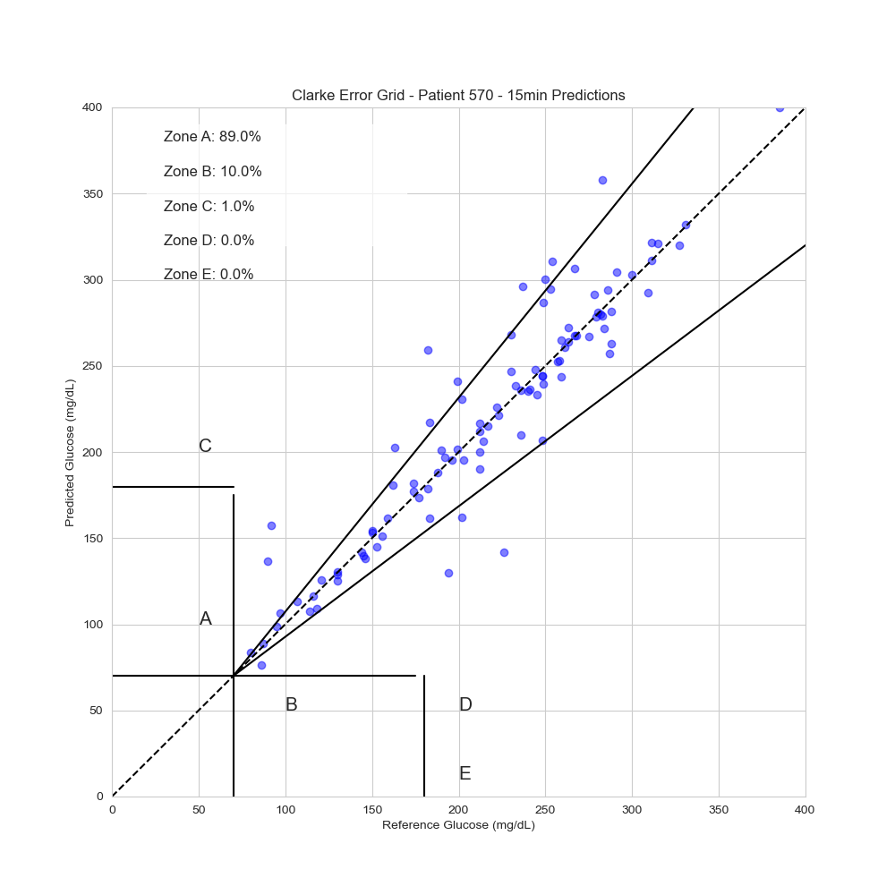

# Blood Glucose Level Prediction System

A comprehensive system for predicting future blood glucose levels for patients with diabetes, with validation tools to ensure accuracy and clinical safety.

## Overview

This project provides:

1. **Blood Glucose Prediction APIs**: Real-time APIs that predict future glucose levels based on current and past data.
2. **Validation Framework**: Tools to validate prediction accuracy against historical data.
3. **Web Interface**: User-friendly interface for accessing predictions and visualizing results.


*Sample Clarke Error Grid Analysis showing prediction clinical accuracy*

## Project Structure

```
.
├── simple_glucose_api.py         # Simplified prediction API
├── glucose_prediction_api.py     # ML model-based prediction API
├── test_simple_api.py            # Testing script for simple API
├── validate_api.py               # Prediction validation framework
├── compare_api_predictions.py    # API comparison tool
├── web_interface.py              # Web interface for the prediction system
│
├── models/                       # Trained machine learning models
│   ├── 570/                      # Models for patient 570
│   │   ├── rf_15min.pkl          # Random Forest model for 15-min predictions
│   │   └── ...                   # Other models for different horizons
│   ├── 575/                      # Models for patient 575
│   └── ...                       # Models for other patients
│
├── features/                     # Feature datasets
│   ├── 570_test_features.csv     # Test features for patient 570
│   ├── 570_train_features.csv    # Training features for patient 570
│   ├── 2018_test_features.csv    # 2018 test dataset (multiple patients)
│   ├── 2020_test_features.csv    # 2020 test dataset (multiple patients)
│   └── ...                       # Other feature files
│
├── templates/                    # HTML templates for web interface
│   ├── index.html                # Main page template
│   ├── login.html                # Login page template
│   └── ...                       # Other templates
│
├── static/                       # Static assets for web interface
│   ├── css/                      # CSS stylesheets
│   ├── js/                       # JavaScript files
│   └── img/                      # Images
│
├── documentation/                # Documentation files
│   ├── VALIDATION_README.md      # Validation guide
│   ├── API_VALIDATION_OVERVIEW.md # Validation suite overview
│   └── VALIDATION_RESULTS_REPORT.md # Validation results analysis
│
├── .gitignore                    # Git ignore file
├── requirements.txt              # Project dependencies
├── LICENSE                       # MIT license
└── README.md                     # This file
```

## APIs

Two types of prediction APIs are available:

1. **Simple Glucose API** (`simple_glucose_api.py`): Rule-based prediction that doesn't require pre-trained models. Provides quick, reliable predictions.

2. **ML-based API** (`glucose_prediction_api.py`): Uses trained machine learning models for more accurate predictions. Requires compatible scikit-learn version.

Both APIs provide predictions for multiple time horizons (15, 30, 45, 60 minutes into the future).

## Installation

```bash
# Clone the repository
git clone https://github.com/yourusername/Blood-Glucose-Level-Prediction.git
cd Blood-Glucose-Level-Prediction

# Create and activate a virtual environment (optional but recommended)
python -m venv venv
source venv/bin/activate  # On Windows: venv\Scripts\activate

# Install dependencies
pip install -r requirements.txt

# Generate sample data (since the actual dataset requires a DUA)
python create_sample_data.py
```

## Quick Demo

To quickly run through the entire workflow, use the demo script:

```bash
./run_demo.sh
```

This script will:
1. Check and install dependencies
2. Generate sample data
3. Preprocess the data
4. Start the prediction API
5. Test the API with sample data

For a more detailed walkthrough, see [END_TO_END_DEMO.md](END_TO_END_DEMO.md).

## Dataset Information

This project uses the OhioT1DM dataset format, which contains data for people with type 1 diabetes including:
- CGM blood glucose readings
- Insulin doses
- Meal information
- Self-reported life events

For legal and ethical reasons, the actual OhioT1DM dataset is not included in this repository as it requires a Data Use Agreement (DUA). Instead, we provide:

1. A sample data generator (`create_sample_data.py`) to create synthetic data in the same format
2. A data cleaning tool (`clean_data.py`) for managing dataset files
3. A convenient management script (`manage_data.sh`) for all data operations

```bash
# Generate synthetic sample data
./manage_data.sh create-sample

# Remove real data but keep sample data
./manage_data.sh clean-keep

# Display all commands
./manage_data.sh help
```

See [SAMPLE_DATA_README.md](SAMPLE_DATA_README.md) for detailed information on working with the dataset.

## Running the APIs

```bash
# Start the simple API
python simple_glucose_api.py

# Test the API
python test_simple_api.py
```

The API will be available at `http://localhost:8001/`.

## API Endpoints

- **GET /** - API information
- **GET /patients** - List available patient IDs
- **GET /horizons?patient_id=X** - List available prediction horizons
- **POST /predict** - Make a prediction

Example prediction request:
```json
{
  "patient_id": 570,
  "glucose_value": 180.0,
  "glucose_diff": 2.5,
  "glucose_diff_rate": 0.5,
  "hour": 14,
  "day_of_week": 2,
  "insulin_dose": 0,
  "insulin_dose_1h": 0,
  "carbs_1h": 0
}
```

## Validation Framework

The project includes a comprehensive validation framework to assess prediction accuracy:

```bash
# Validate against test data
./validate_api.py --test_file features/570_test_features.csv --patient_ids 570 --horizons 15,30 --api_url http://localhost:8001
```

See [VALIDATION_README.md](VALIDATION_README.md) for detailed usage instructions.

### Validation Metrics

- Mean Absolute Error (MAE)
- Root Mean Squared Error (RMSE)
- R² score
- In-range accuracy (70-180 mg/dL)
- Clarke Error Grid analysis

## Comparing Different APIs

```bash
./compare_api_predictions.py --test_file features/570_test_features.csv --patient_id 570 --api_url_1 http://localhost:8000 --api_url_2 http://localhost:8001 --api_1_name "ML-Based" --api_2_name "Simple"
```

## Performance

The Simple Glucose Prediction API has been validated with the following results:

- **15-min Horizon**: RMSE 18.87 mg/dL, 91.25% Clarke Zone A
- **30-min Horizon**: RMSE 29.84 mg/dL, 82.00% Clarke Zone A

Average API response time: 1.86ms

## Acknowledgments

- The project uses a synthetic dataset that mimics the structure and format of the [Ohio T1DM Dataset](https://pmc.ncbi.nlm.nih.gov/articles/PMC7881904/)
- For research purposes, the actual OhioT1DM dataset requires a Data Use Agreement (DUA)
- See [SAMPLE_DATA_README.md](SAMPLE_DATA_README.md) for information on the sample data and how to obtain the real dataset
- Clarke Error Grid implementation adapted from multiple sources

## License

This project is licensed under the MIT License - see the LICENSE file for details.